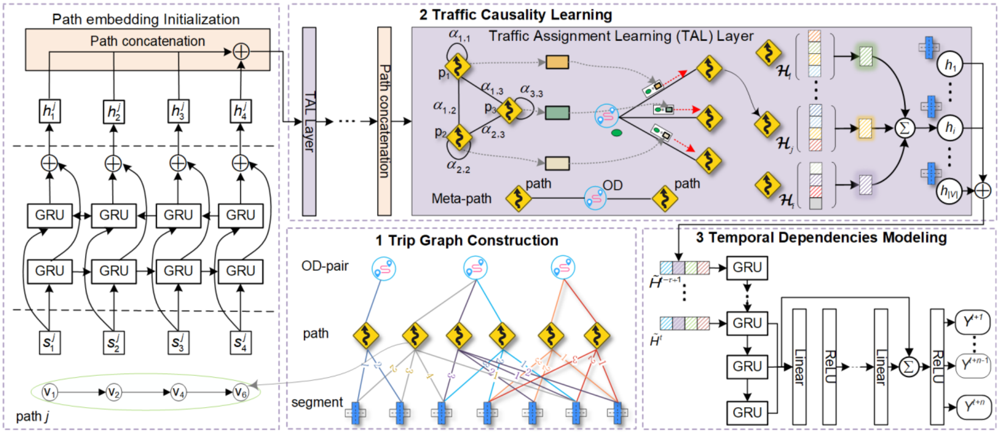

# Official TraffNet v1

Implementation of paper - [TraffNet: Learning Causality of Traffic Generation for What-if Prediction](https://arxiv.org/abs/2303.15954)

[](https://arxiv.org/abs/2303.15954)


## <div align="center">Documentation</div>

See below for a quickstart installation and usage example for TraffNet.

<details open>
<summary>Install</summary>

We recommend installing  all the packages contained in the requirements file under python>=3.8 and CUDA 11.8.
```bash
conda create -n traffnet python==3.8
conda activate traffnet
pip install -r ./requirements.txt
```

</details>

<details open>
<summary>Datasets</summary>

Create a folder under the datasets folder with the name of the data and put the constructed data in it. See this repository for the data construct process [trip-graph-construction](https://github.com/iCityLab/trip-graph-construction). Or download the processed data from this [link]().
```
TraffNet
└──datasets
└────dataname
└──────yourdata
```

</details>

<details open>
<summary>Usage</summary>

The train.py file shows a simple training sample.
```python
from traffnet import TraffNet

if __name__ == '__main__':
    model = TraffNet(r'./configs/sumo_sy-1.yaml')
    model.train()
```

</details>